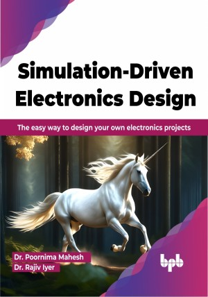

# Simulation-Driven Electronics Design 

Your step-by-step guide to designing and programming electronics

This is the repository for [Simulation-Driven Electronics Design
](https://bpbonline.com/products/simulation-driven-electronics-design?variant=42869556576456),published by BPB Publications.

## About the Book
Simulation plays a vital role in the design of electronics-based projects, as it effectively saves time and money for users by eliminating the need for hardware trial and error. If you want to understand the significance of simulation as an indispensable tool for efficiently iterating, analyzing, and optimizing your electronic projects, this book is a valuable resource.

This book introduces you to the essential tools commonly used by professional electronic project designers. Through this guide, you will gain the ability to select various components suitable for your projects and simulate them without fear of causing any damage. Additionally, the book provides instruction on using diverse simulation tools, enabling you to undertake a wide range of projects—such as building power supplies, designing PCBs, and integrating sensors with microprocessors/microcontrollers. 

By gaining familiarity with design and simulation tools throughout the project development process, this book aims to empower project builders, transforming them into self-assured and capable designers.

## What You Will Learn
•  Streamline the design process in electronics using the Webench (TI) tool.

•  Design power supplies using the TI Webench for efficient and reliable electronic devices.

•  Achieve precise and effective filtering in electronic circuits using the TI Filter Designer.

•  Master Filter Design techniques for signal processing and noise reduction.

•  Gain comprehensive circuit analysis skills by exploring the TI analog simulation tool and understanding basic circuits.
